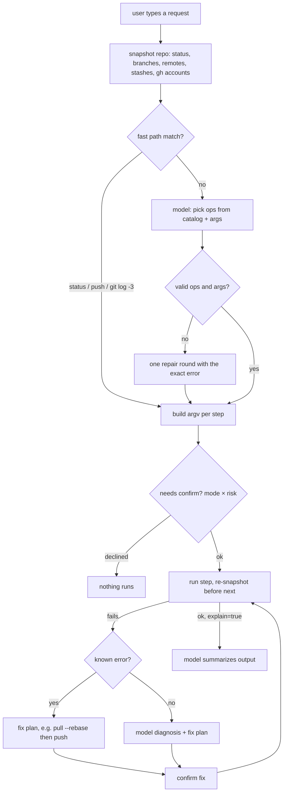
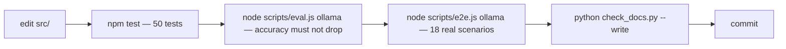

# Architecture

GitCat turns a sentence into git/gh commands **without letting the model write
commands**. The model only chooses operation ids from a fixed catalog and fills
in their arguments; code builds the argv, classifies risk, runs it, and handles
failures. That is what keeps a 4B-parameter local model accurate and fast.

## Directory map

```
bin/gitcat.js            entry point: flags, provider detection, headless vs TUI
src/agent/               the brain (UI-agnostic)
  agent.js               route → plan → confirm → run → debug → explain
  router.js              zero-token fast path (exact phrases, raw git/gh, cd)
  prompt.js              system prompt (full for local, slim for Groq) + debug/commit prompts
  context.js             repo snapshot (porcelain v2) + gh accounts from hosts.yml
  knownErrors.js         deterministic diagnosis/fixes for common git failures
  commitMessage.js       conventional-commit message from the staged diff
src/catalog/             the "boilerplate": ~95 ops, each = params + risk + build()
src/exec/run.js          execa wrapper: no shell, no pager/editor/prompt, colors on
src/llm/index.js         Ollama + Groq behind one chat(), fallback order, warmup
src/ui/                  Ink (React) terminal UI: App, header, cat, prompt, confirm
src/headless.js          `gitcat -p "..."` one-shot mode (scripts, tests)
src/config/settings.js   .env loading, ~/.gitcat settings + history
scripts/eval.js          planner accuracy/latency against the real models
scripts/e2e.js           real model + real git scenario run
test/                    node:test suites (catalog, parsing, agent e2e, TUI)
```

## Components

| Component | Owns | Entry point |
|---|---|---|
| Router | exact phrases like `push`, raw `git …`, `cd …` → steps with no model call | `src/agent/router.js` `fastRoute()` |
| Planner | one model call → `{reply, steps:[{op,args}], ask, explain}`; validates every step with `resolveStep`, one repair round if invalid | `src/agent/agent.js` `askModel()` |
| Catalog | op ids, param specs (`"str!"`, `"bool"`, `"a|b"`), risk tier, `build(args, ctx) → argv[]` | `src/catalog/index.js` `resolveStep()`, `buildCommands()` |
| Executor | confirm policy by mode × risk, re-snapshot between steps, auto commit message, internal steps (`.gitignore`, `cd`) | `agent.js` `execute()` |
| Debugger | known-error table first (instant), else model diagnosis; fix plan always confirmed; max 2 rounds | `agent.js` `debug()` + `knownErrors.js` |
| LLM | provider order, slim prompt for Groq, Ollama KV-cache warmup | `src/llm/index.js` `chat()` |
| TUI | Static transcript, animated cat + status, prompt with slash menu/history, confirm box | `src/ui/App.js` `startApp()` |

## Flow: one request



The step that surprises people: **commands are built at run time, not plan
time.** `push` after `branch_create` must see the new branch to add
`-u origin <branch>`, so the executor re-snapshots between steps. If that
snapshot were skipped, the second step would push the old branch.

## Flow: how a change ships



`scripts/eval.js` is the one that catches prompt regressions: a wording change
in a catalog description moved local accuracy from 90% to 96% during
development, and a JSON-schema change dropped it to 70%.

## Data

| What | Where | Lifetime |
|---|---|---|
| settings (provider, models, mode) | `~/.gitcat/settings.json` | persistent |
| prompt history (↑) | `~/.gitcat/history.json`, last 200 | persistent |
| conversation turns (for "push that too") | memory, last 6 | per session |
| gh accounts | parsed from gh's `hosts.yml`, cached | per session, reset after a switch |
| API keys | `.env` in GitCat's folder or `~/.gitcat/.env` | never in the target repo |

## Boundaries

| External | Used for | When it's down |
|---|---|---|
| Ollama (localhost:11434) | primary model | falls back to Groq if a key exists |
| Groq API | fallback model (slim prompt) | falls back to Ollama; 429 at 8k tokens/min |
| git | everything | nothing works; launcher checks it |
| gh | GitHub ops, account switching | GitHub ops fail with gh's error; git ops fine |
| Neither model | — | fast path, `/` shortcuts and raw `git …` still work |
